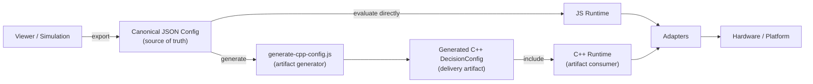
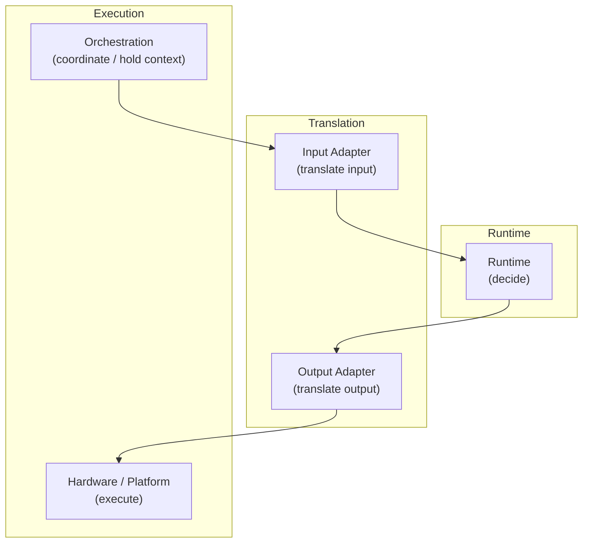

# Architecture Overview

This document summarizes the current repository-wide architecture of
`decision-engine-core`.

It is intended as the top-level architecture map for the current codebase:

- what the repository is
- which artifacts are the source of truth
- how the JS and C++ runtimes fit together
- where adapters, examples, tests, and vectors belong

At its core, `decision-engine-core` is a decision runtime/toolchain that turns
physical input or state-like values into deterministic `state` and `action`
outputs based on canonical config.

The center of the architecture is not a single runtime implementation in
isolation. The center is the canonical config model as the source of truth,
with JS simulation, the embedded-oriented C++ runtime, the viewer, the
generator, examples, and tests connected around it.

In that sense, `decision-engine-core` should be read as a decision toolchain
with multiple connected layers rather than as a single runtime implementation.

The current layer roles are:

- Specification Layer
  - defines the canonical config shape and the runtime behavior contract
- Authoring / Viewer Layer
  - creates, inspects, and simulates config
- JS Core Layer
  - evaluates `state` and `action` in JS as the reference runtime
- Generator Layer
  - converts canonical JSON into generated artifacts for embedded runtimes
- C++ Runtime Layer
  - consumes generated config / `DecisionConfig` and evaluates `state` and
    `action` without a runtime JSON parser
- Adapter / Integration Layer
  - translates sensor input and hardware output to and from runtime
    input/result and connects the runtime to real execution environments
- Examples Layer
  - shows how the layers are connected in representative usage flows
- Test / Vectors Layer
  - fixes the config boundary, runtime behavior, JS/C++ parity, and expected
    input/output contracts

In shorter form, the repository consists of:

- a layer that defines config and runtime contracts
- a layer that creates and simulates config
- a layer that evaluates config
- a layer that converts config into delivery artifacts
- a layer that connects runtime behavior to real hardware or simulators
- a layer that verifies behavior contracts

## 2.1 Layer Responsibilities and Non-Responsibilities

One of the clearest architectural patterns in this repository is that layers
are separated not only by what they do, but also by what they explicitly do
not do.

### Specification Layer

Responsible for:

- canonical config contract
- runtime behavior contract
- portable semantics definition

Not responsible for:

- runtime execution
- hardware integration
- config generation
- viewer behavior
- test execution

### Authoring / Viewer Layer

Responsible for:

- config authoring
- simulation
- visualization
- editing canonical config
- scenario inspection

Not responsible for:

- embedded execution
- hardware control
- runtime core semantics definition
- portable contract definition

### JS Core Layer

Responsible for:

- JS runtime evaluation
- reference runtime behavior
- JS-side simulation/runtime execution
- config consumption
- rule evaluation
- state/action resolution

Not responsible for:

- hardware execution
- sensor polling
- embedded deployment
- config authoring UI

### Config Boundary Layer

Responsible for:

- canonical config acceptance
- config shape normalization
- supported config validation
- boundary enforcement

Not responsible for:

- runtime semantics
- hardware behavior
- generator output
- orchestration

### Generator Layer

Responsible for:

- canonical JSON -> generated artifact projection
- C++ runtime delivery artifact generation
- parser-free embedded delivery path

Not responsible for:

- runtime behavior
- hardware integration
- runtime execution
- config semantics definition

### C++ Runtime Layer

Responsible for:

- portable runtime evaluation
- parser-free state/action resolution
- rule execution
- escalation execution
- `DecisionConfig` consumption

Not responsible for:

- JSON parsing
- hardware APIs
- config generation
- sensor polling
- orchestration
- runtime state ownership
- diagnostic richness

### Adapter Layer

Responsible for:

- external input -> `DecisionInput` translation
- `DecisionResult` -> external action translation
- representation conversion

Not responsible for:

- runtime semantics
- scheduling
- hardware lifecycle management
- config definition

### Orchestration Layer

Responsible for:

- scheduling
- polling
- runtime state ownership
- timing
- lifecycle coordination
- runtime invocation order

Not responsible for:

- rule semantics
- state/action decision logic
- config schema definition

### Hardware / Platform Layer

Responsible for:

- sensor SDK access
- GPIO/PWM
- board APIs
- device execution
- physical I/O

Not responsible for:

- runtime semantics
- config interpretation
- state/action decision logic

### Examples Layer

Responsible for:

- representative usage flows
- integration examples
- runtime/adapter/hardware connection examples
- sample configs

Not responsible for:

- source-of-truth semantics
- runtime contract definition
- portable behavior definition

### Vectors Layer

Responsible for:

- shared behavior fixtures
- expected input/output samples
- parity intent
- reusable runtime behavior samples

Not responsible for:

- runtime execution
- assertions
- config validation

### Test Layer

Responsible for:

- contract verification
- parity verification
- runtime behavior verification
- config boundary verification
- regression detection

Not responsible for:

- defining architecture
- defining runtime semantics
- defining canonical config

For more focused documents:

- `CONFIG_SPEC.md` defines canonical config shape
- `docs/runtime-spec.md` defines runtime behavior
- `docs/toolchain-overview.md` defines config-to-runtime flow
- `docs/runtime-integration.md` defines integration boundaries
- `docs/adapter-pattern.md` and `docs/adapter-authoring-guide.md` define adapter responsibilities

## 1. What `decision-engine-core` Is

`decision-engine-core` is a canonical-config-centered, multi-runtime decision
runtime and tooling repository.

It provides:

- a canonical config model for decision behavior
- a JS reference runtime
- an embedded-oriented C++ runtime
- a generator that projects canonical JSON into C++ runtime artifacts
- representative examples for simulation and embedded integration
- tests and vectors that define portable behavior parity

It does not aim to be:

- a device SDK collection
- a hardware abstraction framework
- a board-specific deployment system

## 2. Core Architectural Idea

The core idea is:

```text
decision behavior is defined once as canonical config,
then reused across multiple runtimes and integration environments
```

The repository separates:

- config definition
- runtime evaluation
- adapter translation
- orchestration
- hardware execution

This separation makes it possible to:

- keep decision behavior portable
- run equivalent logic in JS and C++
- generate embedded-friendly runtime artifacts without adding a JSON parser to the C++ runtime
- reuse the same decision model across simulation, testing, and embedded execution

## 3. Canonical Config as Source of Truth

Canonical JSON config is the source of truth for runtime behavior.

The canonical shape is defined by:

- `states[]`
- `rules[]`
- `escalations`

The canonical config is:

- authored in the viewer
- validated in JS tooling
- evaluated directly by the JS runtime
- projected by the generator into a generated C++ `DecisionConfig` artifact

Canonical JSON is not the same thing as a generated C++ header.

- canonical JSON
  - source of truth
- generated C++ header
  - delivery artifact for embedded builds

## 4. Toolchain Overview



This toolchain is intentionally asymmetric:

- JS can operate directly on canonical config
- C++ consumes generated config artifacts

That asymmetry is intentional because:

- JS is used for validation, simulation, and tooling
- C++ is used for embedded-oriented execution
- embedded runtime integration benefits from parser-free build artifacts

## 5. Runtime / Adapter / Orchestration / Hardware Boundary

The runtime boundary is:



Current intended meaning:

- runtime
  - decide
- adapter
  - translate
- orchestration
  - coordinate
- hardware/platform
  - execute

More concretely:

- runtime
  - rule evaluation
  - state resolution
  - action resolution
  - escalation behavior
- input adapter
  - external state -> `DecisionInput`
- output adapter
  - `DecisionResult.action` -> command/effect
- orchestration
  - hold `previousValue`, `previousState`, `stateDurationMs`
  - schedule reads/evaluation
  - call adapters and runtime
- hardware/platform
  - sensor SDKs
  - GPIO / PWM / I2C
  - board-specific lifecycle

## 6. JS Runtime Layer

Repository area:

- `src/`

Role:

- reference runtime implementation
- canonical config consumer
- validation and normalization boundary
- local tooling/runtime entrypoint

Current internal split:

- runtime semantics
  - `src/evaluate.js`
  - `src/rules.js`
- config boundary
  - `src/normalizeConfig.js`
  - `src/validateConfig.js`
- defaults / compatibility / preset convenience
  - `src/resolveConfig.js`
  - `src/config.js`
  - `src/presets/*`

Current architectural reality:

- JS runtime is still the reference runtime
- JS runtime still contains convenience behavior beyond the minimum portable contract

Examples of JS-only convenience:

- richer input enrichment (`tempDelta`, `tempRate`, `tempRateAvg`)
- compatibility/default config resolution
- diagnostic result enrichment (`reason`, `debug`)
- fallback logic derived from richer input when explicit fields are absent

So the JS side is best understood as:

```text
portable runtime behavior
+ JS convenience / compatibility layer
```

## 7. C++ Runtime Layer

Repository area:

- `runtimes/cpp/`

Role:

- embedded-oriented runtime implementation
- parser-free config consumer
- portable runtime core for `DecisionInput -> DecisionResult`

The C++ runtime is intentionally smaller than the JS runtime.

It does not include:

- JSON parsing
- config normalization
- config validation
- viewer/tooling convenience behavior
- diagnostic result enrichment
- hardware access

It consumes:

- `DecisionConfig`
- `DecisionInput`

and returns:

- `DecisionResult`

Current design direction:

- domain-neutral runtime core
- generic `DecisionConfig` fields
- example-specific semantics moved to generated config / examples / tests

This means the C++ runtime is no longer tied directly to hardcoded domain names
such as `hot`, `critical`, `fan_low`, or `fan_high`.

## 8. Generator Layer

Repository area:

- `scripts/generate-cpp-config.js`

Role:

- bridge from canonical JSON to embedded C++ artifact

The generator:

- validates canonical config before generation
- reads canonical JSON
- projects canonical config into generated C++ `DecisionConfig`
- emits a header file for embedded builds

The generator does not:

- define runtime semantics
- execute runtime behavior
- generate hardware config
- perform deployment

Important separation:

- canonical JSON
  - source of truth
- generator
  - bridge
- generated C++ header
  - delivery artifact
- runtime
  - artifact consumer

## 9. Examples Layer

Repository area:

- `examples/`

Role:

- integration and usage layer

It demonstrates how the core pieces are assembled in practice.

Current example roles:

- `examples/temperature.js`
  - smallest JS runtime call example
- `examples/inputs/`
  - shared sample runtime inputs
- `examples/node-temp-sim/`
  - JS simulation / mock deploy example
  - canonical config + input sequence + JS adapters
- `examples/m5-temp-fan/`
  - representative embedded integration example
  - generated config + C++ runtime + adapters + PWM/LED verification

The example layer does not define:

- canonical config schema
- runtime semantics
- portable contract by itself

It demonstrates those contracts in runnable form.

## 10. Test / Vectors Layer

Repository areas:

- `test/`
- `vectors/`
- `runtimes/cpp/run_test_vectors.cpp`
- `runtimes/cpp/run_generated_config_test.cpp`

Role:

- fix the contracts the repository intends to preserve

### `test/`

Primarily covers:

- canonical config validation
- canonical normalization behavior
- JS runtime behavior
- JS/C++ parity expectations

### `vectors/`

`vectors/` is not just test data.

It is the shared portable behavior fixture layer.

Current meaning:

- reusable input / expected-output samples
- stable parity reference point
- shared fixture intent across tests, examples, and C++ parity runners

This is why `vectors/` currently lives at the repository root rather than under
`test/`.

## 11. Portable Behavior Parity

Parity in this repository does not mean implementation identity.

It means:

```text
equivalent portable runtime behavior
for equivalent config and input conditions
```

In practice, parity is currently checked at the level of:

- `state`
- `action`

not:

- internal intermediate values
- debug fields
- diagnostic output
- implementation-specific helper paths

This is especially important for JS/C++ comparison:

- JS runtime includes convenience behavior beyond the minimum portable contract
- C++ runtime stays closer to the minimum embedded-oriented core

So parity is interpreted as:

```text
portable behavior contract parity
```

not:

```text
identical runtime implementation
```

## 12. Current Architectural Direction

The current architectural direction is:

- canonical-config-centered
- multi-runtime
- portable-runtime-oriented
- adapter-based integration
- parser-free embedded artifact delivery

The repository is moving away from:

- JS-only framing
- hardcoded example-specific runtime defaults in core runtime types
- mixed domain/runtime concerns inside the embedded runtime core

and toward:

- explicit source-of-truth config
- generic runtime consumers
- generated runtime artifacts
- clearer layer boundaries

## 13. Known Asymmetry / Future Cleanup Candidates

The current architecture is intentionally usable, but not perfectly symmetric.

Known asymmetries:

- JS runtime still includes convenience and compatibility behavior
- C++ runtime is closer to the minimum portable runtime core
- generator currently projects example-specific canonical escalation names into generic C++ artifact fields
- some docs/examples still carry older wording and may need periodic cleanup

Likely cleanup candidates:

- further separate portable JS runtime core from JS convenience wrapper
- continue reducing compatibility/default behavior in JS runtime core paths
- expand generator tests
- add broader parity coverage around generated artifacts
- consider future runtime layout cleanup such as `runtimes/js/`

These are cleanup candidates, not immediate redesign requirements.

## 14. Repository Layer Summary

```text
Authoring Layer
  viewer/

Specification Layer
  CONFIG_SPEC.md
  docs/runtime-spec.md
  docs/runtime-integration.md
  docs/adapter-pattern.md
  docs/adapter-authoring-guide.md
  docs/toolchain-overview.md

Generation Layer
  scripts/generate-cpp-config.js

Runtime Layer
  src/
  runtimes/cpp/

Integration Layer
  examples/

Verification Layer
  test/
  vectors/
  runtimes/cpp/run_test_vectors.cpp
  runtimes/cpp/run_generated_config_test.cpp
```

This repository should currently be read as:

```text
canonical config source
  -> multiple runtime consumers
  -> adapter-based integration
  -> shared parity and verification
```

not as:

```text
a single JS runtime package with optional extras
```
