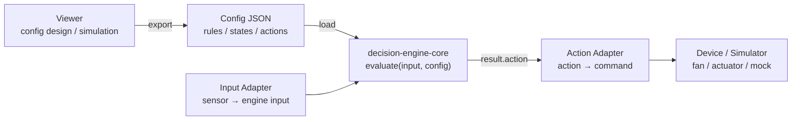

# Runtime Integration Design

## Decision Runtime System Context

This document describes how `decision-engine-core` fits into the Decision Runtime System (DRS).

DRS consists of:

- Runtime Specification (language-independent behavior rules)
- Runtime Implementations (JS, C++, etc.)
- Viewer (config design and simulation)
- Adapters (input/output transformation)
- Device Runtime (embedded execution environment)

In this structure:

- `decision-engine-core` is the canonical-config-centered runtime and tooling repository
- the JS runtime is the primary reference implementation
- the embedded-oriented C++ runtime already exists as an alternative implementation
- `docs/runtime-spec.md` defines the current portable behavior contract
- `examples/m5-temp-fan/` provides the representative embedded integration example

## 1. Purpose

This document defines how `decision-engine-core` connects to real or simulated devices.

For adapter boundary details, see [Adapter Pattern](adapter-pattern.md).

The current goal is not to control hardware directly from the core package.

The goal is to clarify the boundary between:

- core
- viewer
- config
- adapter
- device

## 1.1 Current JS Runtime Structure

The current JS runtime is split into a portable core and wrapper layers.

- `runtimes/js/core`
  - source-of-truth for portable JS runtime semantics
- `src/runtimeCore.js`
  - CommonJS compatibility bridge for existing `src/` consumers
- `src/evaluate.js`
  - JS convenience wrapper around the portable core
- `viewer/src/lib/browserRuntimeCore.js`
  - viewer-local ESM copy kept meaningfully aligned with the same semantics
- `viewer/src/lib/browserEngine.js`
  - browser-side wrapper around the portable core
- `viewer/src/lib/engineAdapter.js`
  - viewer runtime consume boundary

This viewer-local ESM copy is intentionally retained for now.

The following are still intentionally unresolved:

- package exports for an official JS runtime core
- a formal CommonJS/ESM bridge
- direct viewer imports of an official JS runtime core

Until those decisions are made, these modules should be treated as internal
structure rather than public API.

Current public/internal boundary:

- public now
  - `src/index.js` via `evaluate`
- current public wrapper / future main export candidate
  - `src/evaluate.js`
- internal now
  - `runtimes/js/core/index.js`
  - `runtimes/js/core/index.mjs`
  - `src/runtimeCore.js`
  - `viewer/src/lib/browserEngine.js`
  - `viewer/src/lib/browserRuntimeCore.js`
- future public candidates
  - main/default runtime entry: `src/evaluate.js`
  - core subpath entry: `runtimes/js/core`

`runtimes/js/core/index.js` remains the portable semantics source-of-truth, but
it is still internal at this stage. `runtimes/js/core/index.mjs` is likewise an
internal ESM/browser-consumable entry rather than a public API or package
export.

### Maintenance Note: Viewer-local ESM Copy

`viewer/src/lib/browserRuntimeCore.js` is maintained as a viewer-local ESM copy
of `runtimes/js/core`.

Sync target:

- `matchRule`
- `findStateAction`
- `deriveState`
- `deriveActionCore`

These are the portable state/action semantics that should stay meaningfully
aligned across:

- `runtimes/js/core`
- the viewer-local ESM copy
- JS/C++ parity expectations

The main synchronization checks are:

- JS/C++ parity tests
- JS/viewer runtimeCore parity tests
- JS runtime three-way parity tests

Not part of this parity boundary:

- browser fallback behavior
- diagnostics / debug enrichment
- `buildResult`
- `normalizeInput`
- config resolution
- viewer orchestration

ESM/browser import strategy remains unresolved, so the viewer-local ESM copy is
still maintained explicitly rather than treated as a stable public import path.

Current parity maintenance period:

- `runtimes/js/core`
  - CommonJS source-of-truth
- `runtimes/js/core/index.mjs`
  - internal ESM/browser-consumable entry
- `viewer/src/lib/browserRuntimeCore.js`
  - viewer-local ESM copy

The viewer-local ESM copy is still intentionally retained, and viewer import
replacement is not performed yet. Public exports and viewer replacement remain
follow-up decisions after this parity maintenance period.

Current consume topology:

- `src/evaluate.js` currently consumes the core through the
  `src/runtimeCore.js` CommonJS bridge
- `test/js-viewer-runtimecore-parity.test.js` also uses that bridge when
  comparing root-side semantics to the viewer-local ESM copy
- `runtimes/js/core` is currently read directly only by `src/runtimeCore.js`

Near-term direct-consume candidates:

- `src/evaluate.js`
- root parity tests

Not a direct-consume candidate yet:

- viewer runtime paths

Viewer consume boundary note:

- viewer UI/components do not consume the runtime core directly
- the viewer-side consumer boundary is `viewer/src/lib/engineAdapter.js`
- the current runtime path is:
  `useSimulation -> engineAdapter -> browserEngine -> browserRuntimeCore`
- the smallest semantics-source replacement point is
  `viewer/src/lib/browserEngine.js`
- the stable viewer-facing boundary remains `viewer/src/lib/engineAdapter.js`

This keeps future viewer-local ESM copy replacement work from spreading into UI
components or higher-level viewer orchestration.

The bridge is intentionally retained for now because it keeps the root package
CommonJS, avoids package export changes, leaves ESM/browser strategy open, and
supports low-risk incremental migration.

## 1.2 Next-phase JS Runtime Entry Strategy

The current direction is to treat future public JS runtime entrypoints as two
layers:

- default / main runtime entry
  - JS convenience runtime
- core subpath entry
  - portable JS runtime core

Recommended layering:

- `runtimes/js/core`
  - portable core
- `src/evaluate.js`
  - JS convenience runtime candidate
- `viewer/src/lib/browserEngine.js`
  - browser/viewer wrapper prototype
- `viewer/src/lib/engineAdapter.js`
  - viewer consume boundary

`browserEngine.js` should not be treated as the future official browser runtime
as-is because it still carries viewer-specific assumptions. It remains useful
as a browser wrapper prototype.

`src/evaluate.js` is the current JS convenience runtime wrapper and the future
main/default runtime export candidate. It is intentionally not the portable
core; portable deterministic state/action semantics remain in `runtimes/js/core`.

The CommonJS/ESM browser bridge should be absorbed by the provider/package
side, not by the viewer consumer side.

The viewer-local ESM copy is expected to remain for now and only becomes a
replacement target after an official ESM/browser-consumable entry exists.

`package.exports` remains intentionally unchanged for now.

If direct consume is introduced later, it should be limited to the portable
core or the JS convenience runtime, not viewer-specific wrappers.

## 1.3 Future Export / Browser Entry Direction

The current direction is to treat future JS runtime exports as two layers:

- main/default export
  - JS convenience runtime
- core subpath export
  - portable JS runtime core

Browser-consumable entry should start from an official ESM/browser entry for
the portable core, not from viewer-specific wrappers.

`viewer/src/lib/browserEngine.js` should remain internal because it still
contains viewer-oriented browser wrapper assumptions and is better treated as a
prototype rather than a public runtime export.

If the viewer-local ESM copy is replaced later, the intended replacement target
is an official browser/ESM core entry, not `browserEngine.js`.

CommonJS/ESM dual-entry concerns should continue to be absorbed by the
provider/package side, not by the viewer consumer side.

Before expanding `package.exports`, the following boundaries should be treated
as fixed first:

- portable core boundary
- convenience runtime boundary
- browser wrapper boundary
- public API commitment

The preferred migration order is:

1. internal core boundary
2. browser/ESM core entry
3. viewer-local ESM copy replacement
4. core subpath export
5. convenience runtime export

Current internal note:

- `runtimes/js/core/index.mjs` is an internal ESM/browser-consumable core entry
- it is not a public API or package export at this stage
- the source-of-truth remains `runtimes/js/core/index.js`
- synchronization is checked through CommonJS/ESM parity tests
- this entry exists to validate a future replacement path for the viewer-local
  ESM copy

Before any public export promotion, build-based generation or a formal dual
package strategy should be reconsidered. This handwritten/bridge-style ESM
entry is intentionally temporary rather than a long-term fixed public shape.

---

## 2. Overall Flow


```mermaid
flowchart LR

  Viewer["Viewer<br/>config design / simulation"]
  Config["Config JSON<br/>rules / states / actions"]
  InputAdapter["Input Adapter<br/>sensor → engine input"]
  Core["decision-engine-core<br/>evaluate(input, config)"]
  ActionAdapter["Action Adapter<br/>action → command"]
  Device["Device / Simulator<br/>fan / actuator / mock"]

  Viewer -->|export| Config
  Config -->|load| Core
  InputAdapter --> Core
  Core -->|result.action| ActionAdapter
  ActionAdapter --> Device
```

This diagram represents the separation of responsibilities:

- Viewer creates and exports config
- Config is passed unchanged into the core
- Core evaluates input and determines state/action
- Adapters translate between real-world signals and engine data
- Device executes the final command

Important principle:
The core does not depend on device or platform.

```txt
viewer
  ↓ export config JSON
config
  ↓ load
decision-engine-core
  ↓ result.action
adapter
  ↓ device command
device / simulator
```

Detailed flow:

```txt
sensor value
  ↓
input adapter
  ↓
engine input
  ↓
evaluate(input, config)
  ↓
result: state / action
  ↓
action adapter
  ↓
device command
  ↓
fan / actuator / mock output
```

## 3. Responsibility Boundaries

### 3.1 `decision-engine-core`

Responsibility

`decision-engine-core` decides state and action from input and config.

`input + config -> state / action`

In scope

- rule evaluation
- state decision
- action decision
- duration / escalation logic
- config validation

Out of scope

- sensor reading
- GPIO / PWM control
- device communication
- file transfer
- UI
- real hardware deployment

### 3.2 `viewer`

Responsibility

The viewer is a design and verification tool for config.

In scope

- select preset
- edit config
- simulate input values
- visualize state / action transitions
- save workspace locally
- export config JSON

Out of scope

- direct hardware control
- direct M5 deployment
- PWM execution
- sensor reading

### 3.3 `config`

Responsibility

Config defines decision behavior as data.

In scope

- states
- rules
- thresholds
- actions
- escalations
- durations
- hysteresis-like conditions

Current transfer format

`JSON`

Current flow:

```txt
viewer
  ↓ Export Config
decision-engine-config.json
  ↓ copy / load
examples/node-temp-sim
```

Future options:

- add config version
- add schema version
- add target profile
- add lightweight embedded format
- generate device-specific code

For the current embedded-oriented C++ path, canonical JSON is projected by the
generator into a generated `DecisionConfig` header. The runtime consumes that
artifact and remains independent from JSON parsing and hardware-specific code.

### 3.4 `adapter`

Adapters connect real-world values and device operations to the engine.

There are two types of adapters.

`input adapter`:
sensor value -> engine input

`action adapter`:
engine action -> device command

Input adapter example

```js
toEngineInput({
  value,
  previousValue,
  timestamp
});
```

Action adapter example

```js
mapActionToFanCommand("fan_low");
// => { pwm: 80 }
```

In scope

- convert sensor values to engine input
- convert action names to device commands
- isolate device-specific mapping

Out of scope

- rule evaluation
- state decision
- config editing
- UI rendering

### 3.5 `device / platform`

Responsibility

The device or platform performs real I/O.

Examples:

- M5Stack
- Raspberry Pi
- Jetson
- browser simulator
- Node.js simulator

In scope

- read sensor
- call input adapter
- call engine
- call action adapter
- write PWM / GPIO / API command
- log runtime result

Out of scope

- deciding state rules directly
- embedding business logic as if-statements
- editing config

## 4. Runtime / Adapter / Hardware Boundary Policy

The runtime is platform-independent.

`decision-engine-core` and compatible runtimes are responsible for evaluating config and returning `state / action`.
They are not responsible for sensor SDKs, GPIO, PWM, I2C, Wi-Fi, or board-specific device control.

The adapter layer connects the runtime to hardware.

- input adapter: sensor/device value -> `DecisionInput`
- output adapter: `action` -> PWM/GPIO/device command

This project provides the adapter pattern and representative examples, not official support for every hardware target.
Users can implement custom adapters for their own environment while keeping the same runtime behavior.

`examples/m5-temp-fan/` is a representative example of this boundary:

- M5Stack / Si7021 reading stays in the example
- DecisionEngine stays device-agnostic
- PWM mapping stays in an output adapter
- current verification target is M5Stack Gray + Si7021 + PWM LED verification
- real fan verification is not yet covered

What the runtime does not do:

- read sensors directly
- own hardware SDK integrations
- provide official board support for all devices

## 5. Current Minimum Architecture

Current repository structure:

```txt
src/
  core engine

viewer/
  config editor and simulator

examples/
  runtime integration experiments

examples/node-temp-sim/
  mock runtime simulation
  adapters/
    input/action adapter examples

examples/m5-temp-fan/
  M5 integration notes
```

Current verified flow:

```txt
viewer
  ↓ export config
examples/node-temp-sim/config/exported-config.sample.json
  ↓ load
examples/node-temp-sim/index.js
  ↓ evaluate
mock PWM output
```

## 6. Mock Deploy Flow

The current runtime verification flow is:

1. Edit config in viewer
2. Export config JSON
3. Replace `examples/node-temp-sim/config/exported-config.sample.json`
4. Run `node-temp-sim`
5. Check state / action / pwm table

Command:

```bash
npm run example:node-temp-sim:sample
```

Expected output concept:

`value -> state -> action -> pwm`

This validates behavior before using real hardware.

## 7. Minimal M5 Runtime Flow

The first real-device target is:

`M5Stack + temperature sensor + fan`

Minimal runtime flow:

```txt
readTemperature()
  ↓
toEngineInput()
  ↓
evaluate(input, config)
  ↓
mapActionToFanCommand(result.action)
  ↓
writePWM(command.pwm)
```

Pseudo code:

```js
const temperature = readTemperature();

const input = toEngineInput({
  value: temperature,
  previousValue,
  timestamp: Date.now()
});

const result = evaluate(input, config);

const command = mapActionToFanCommand(result.action);

writePWM(command.pwm);
```

## 8. Design Decisions So Far

Decided

- core does not control hardware
- viewer exports config as JSON
- adapters stay in examples for now
- M5 integration starts as documentation / example
- mock deploy comes before real device deploy

Not decided yet

- whether runtime state is managed inside engine or outside
- whether input should be single-value or multi-value
- whether action should remain string-based or become structured
- whether adapters should become official packages
- whether config needs versioning
- whether embedded targets need lightweight config format

## 9. Roadmap

Phase 1: Current

- core evaluate
- viewer edit / simulate / export
- node-temp-sim mock deploy
- examples adapters

Status:

`mostly done`

Phase 2: Runtime boundary stabilization

Goal:

make runtime integration understandable and repeatable

Tasks:

- document responsibility boundaries
- document mock deploy flow
- document M5 minimal flow
- compare viewer simulation and node-temp-sim behavior

Phase 3: Runtime state design

Goal:

clarify how `stateDuration` and `previousState` are managed

Options:

- A. external runtime state
- B. stateful engine instance

This should be decided before serious M5 implementation.

Phase 4: M5 prototype

Goal:

run exported config on M5-like runtime

Tasks:

- create M5 pseudo code
- port adapter idea to Arduino / M5 environment
- use exported config or generated equivalent
- compare M5 logs with node-temp-sim logs

Phase 5: Adapter promotion

Goal:

decide whether adapters should remain examples or become official API

Possible future structure:

```txt
packages/core
packages/viewer
packages/adapters
examples/m5-temp-fan
```

Do not move adapters into official packages until the pattern is stable.

## 10. Core Principle

The core principle of this project is:

Decision logic should be externalized as config.
Runtime platforms should only adapt inputs and execute actions.

In short:

- core decides
- viewer designs
- adapter translates
- device executes
