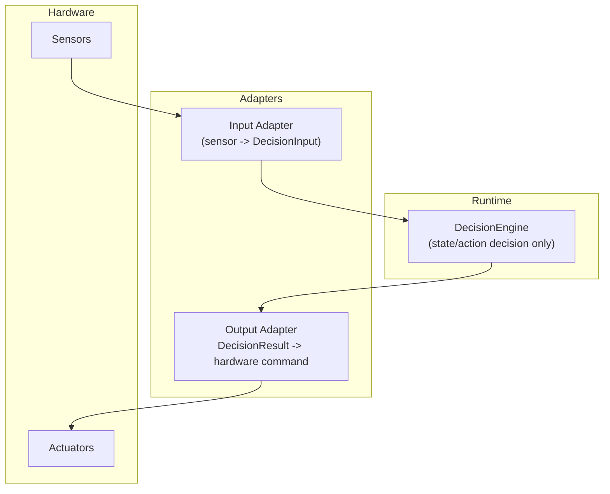

# Toolchain Overview

This document describes how `decision-engine-core` connects viewer output,
canonical config, generated C++ config, runtime evaluation, and embedded
integration.

`runtime-integration.md` explains integration boundaries.
`adapter-pattern.md` and `adapter-authoring-guide.md` explain adapter design.
This document focuses on the config and build toolchain.

```mermaid
flowchart LR

    Viewer["React Viewer / Simulation"]
    Canonical["Canonical JSON Config"]
    Generator["generate-cpp-config.js"]
    Generated["Generated C++ DecisionConfig"]
    CppRuntime["C++ Runtime"]
    Adapters["Input / Output Adapters"]
    Hardware["Hardware / Sensors / Actuators"]

    Viewer -->|export| Canonical
    Canonical -->|generate| Generator
    Generator --> Generated
    Generated -->|include| CppRuntime
    CppRuntime --> Adapters
    Adapters --> Hardware
```



## 1. Purpose

The project uses canonical config so that the same decision behavior can be
represented once and reused across multiple runtimes.

The project keeps JS and C++ runtimes separate because they serve different
execution environments:

- JS runtime is the reference implementation for validation, viewer simulation,
  and local tooling
- C++ runtime is the lightweight embedded-oriented implementation

Both runtimes are expected to evaluate the same canonical config under the same
runtime specification.

## 2. High-Level Architecture

```text
viewer (React)
  ↓
canonical JSON config
  ↓
scripts/generate-cpp-config.js
  ↓
generated C++ header
  ↓
C++ runtime
  ↓
embedded adapters / hardware
```

The viewer and JS runtime operate on canonical JSON directly.
The C++ runtime does not parse JSON at runtime, so canonical JSON is converted
into a generated C++ build artifact first.

## 3. Responsibility Separation

- viewer
  - config editing
  - local simulation
  - canonical JSON export
- JS runtime
  - reference evaluation behavior
  - local validation and parity testing
- canonical config
  - shared runtime behavior definition
  - `states`, `rules`, `escalations`
- generator
  - converts canonical JSON into C++ `DecisionConfig` source
- C++ runtime
  - embedded-oriented evaluation of `DecisionInput -> DecisionResult`
- adapters
  - translate between runtime data and external signals or commands
- hardware config
  - board-specific pins, PWM values, I2C addresses, and wiring assumptions



## 4. Why the C++ Runtime Does Not Parse JSON

The C++ runtime intentionally avoids runtime JSON parsing because the embedded
path benefits from:

- lightweight runtime dependencies
- embedded-friendly memory and binary footprint
- deterministic generated build artifacts
- simpler integration into existing firmware projects

The canonical JSON remains the source format.
The generated header is the embedded delivery format.

## 5. Runtime Config vs Hardware Config

Runtime config belongs to the decision layer:

- `states`
- `rules`
- `escalations`

Hardware config belongs to the device integration layer:

- GPIO
- PWM
- I2C address
- sensor wiring

The generator should only handle runtime config.
Hardware-specific values stay in adapters or application code.

## 6. Current Workflow Example

The current M5 temperature fan example follows this flow:

- `examples/m5-temp-fan/config/fan_config.sample.json`
- `scripts/generate-cpp-config.js`
- `examples/m5-temp-fan/config/generated_fan_config.h`
- `buildFanConfig()`
- `DecisionEngine.evaluate()`
- `fan_output_adapter`

This keeps the runtime config canonical at the JSON level while still producing
an embedded-friendly C++ artifact.

## 7. Future Direction

Likely extensions of this toolchain include:

- improved viewer export paths
- additional generators for other targets
- parity validation across more runtimes
- possible ROS2-oriented integration
- broader multi-runtime architecture support

The core direction remains:

```text
canonical config
  -> generated runtime artifact
  -> runtime evaluation
  -> adapter-based integration
```
