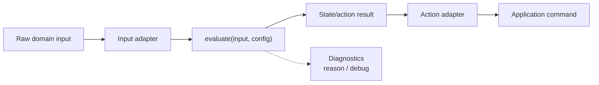

# node-single-step

## Purpose

This example shows the **JS application-side single-step adapter flow** around
`evaluate(input, config)`.

Unlike `node-temp-sim`, this example does not simulate a time series. It shows
how to process **one input snapshot** through adapters, runtime evaluation, and
application-side command handling.

## Flow



## Notes

- Diagnostics are secondary.
- Callers should not depend on the exact `reason` string format or the full
  `debug` object shape.

## Config

This example reuses:

- `examples/node-temp-sim/config/exported-config.sample.json`

## Run

```bash
node examples/node-single-step/index.js
```
